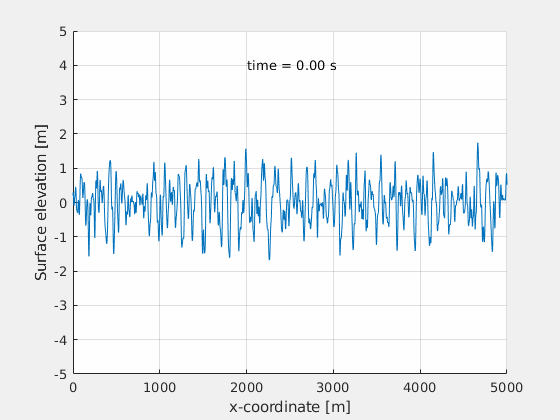

# Assignment 2

Here, calculations with environmental modelling was done. E.g, the surface elevation of the given ITTC spectra looks like this (up until the last second where something glitchy happens):

